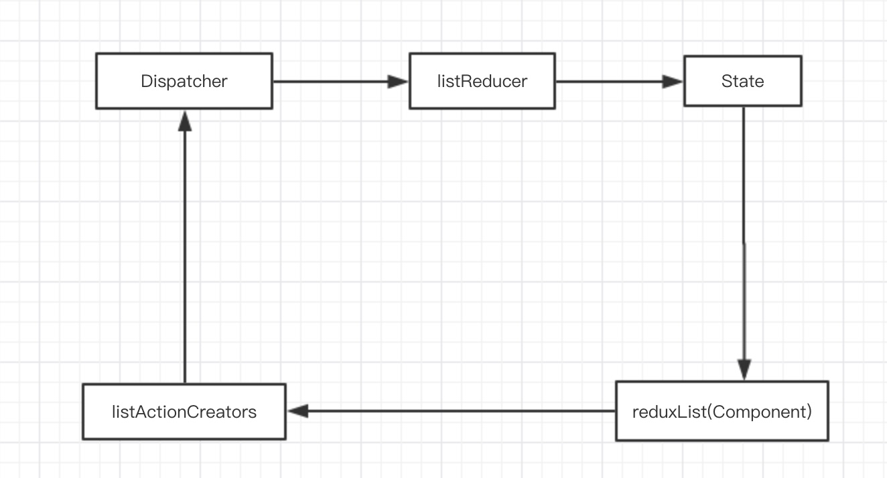

redux-list 
===

## 总览

基于redux的列表状态管理库，对列表的以下几个功能做了状态与行为的标准化封装：

 - 数据请求与展现
 - 数据项选择
 - 分页
 - 排序
 - 筛选

主要有以下三个模块：

listReducer:  列表reducer，根据列表的action信息，通知redux store做出相应的状态更新

listActionCreators: 列表action creators，提供相关的列表行为，派发对应的action

reduxList: 高阶组件创建函数，接受一个配置，返回一个封装了相关列表行为，同时通过props注入了列表状态和actionCreators的高阶组件

## 数据流



## 安装

```shell
npm install @react-redux-ria/redux-list 
```

## 基本使用方式

### 第一步：安装 list reducer

store需要知道如何处理来自列表组件的action，所以我们需要传入库提供的reducer

```javascript
import { createStore, combineReducers } from 'redux'
import { reducer as listReducer } from '@react-redux-ria/redux-list'

const rootReducer = combineReducers({
  // ...其他reducer
  
  // 默认用list作为属性名，需要自定义属性名，可以在reduxList处传入selector，告诉list reducer如何获取列表状态
  list: listReducer
})

const store = createStore(rootReducer)

```

### 第二步：创建并使用列表高阶组件

为了使得列表组件能够连接到store，需要通过 reduxList 函数包裹一层。高阶组件会通过props注入listData和list两个属性完成列表的一系列行为。

listData是一个ListState数据结构，包含着当前列表的状态信息，list则是ListActionCreators数据结构，是列表的actionCreators方法（行为）集合。

大多数情况下，reduxList只需要传入list和fetcher两个配置项，fetcher是一个符合Fetcher数据结构的列表数据获取函数。

以下以antd为例创建列表组件：

```javascript
import React, {PureComponent} from 'react';
import ReactDOM from 'react-dom';
import reduxList from '@react-redux-ria/redux-list';
import {Table} from 'antd';

const tableFields = [
  {
    title: '姓名',
    dataIndex: 'name',
    key: 'name',
    sorter: true,
    filters: [
      {text: 'Joe', value: 'Joe'},
      {text: 'Jim', value: 'Jim'}
    ],
    filterMultiple: false
  },
  {
    title: '年龄',
    dataIndex: 'age',
    key: 'age',
    sorter: true,
    filters: [
      {text: '10', value: 10},
      {text: '11', value: 11}
    ],
  }
];

@reduxList({
  // 列表唯一标识
  list: 'myList',
  // fetcher函数 
  fetcher(query) => ({
    results: [{age: 10, name: 'name1'}, {age: 11, name: 'name2'}]
  }),
  // 列表集合选择器，默认为 state => state.list
  selector: state => state.list
})
export default class ListTable extends PureComponent {

  onSelect = keys => this.props.list.updateSelections(keys);

  onChange = (pagination, filters, {field, order}) => {
    const sort = {field, order};
    this.props.list.fetch({
      page: pagination,
      sort: [sort],
      filters
    });
  };

  // 自定义布局
  render() {
    const data = this.props.listData;
    const rowSelection = {
      selectedRowKeys: data.selections,
      onChange: this.onSelect
    };

    const pagination = data.pager
      ? {
        ...data.pager,
        showTotal: (total, range) => `共 ${total} 记录`
      }
      : false;

    return (
      <div className="my-list">
        <Table
          rowKey="id"
          dataSource={data.results}
          columns={tableFields}
          rowSelection={rowSelection}
          pagination={pagination}
          loading={data.loading}
          onChange={this.onChange}
        />
      </div>
    );
  }
}

ReactDOM.render(<ListTable />, document.body);
```

## 主要数据结构

```flow
// 分页数据结构
type Pager = { current?: number, pageSize?: number, total?: number };

// 排序数据结构
type Sort = Array<{ field: string, order: 'descend' | 'ascend' }>;

// 筛选数据结构
type Filters = { [field: string]: any };

// 列表查询
type ListQuery = { filters?: Filters, page?: Pager, sort?: Sort };

// 列表结果
type ListResult = { results: Array<any>, total: number, current?: number};

// 数据获取函数
type Fetcher = (query: ListQuery) => Promise<ListResult>;

// 列表状态
type ListState = {
  results: Array<any>, // 列表结果
  selections: Array<any>, // 列表选中项
  loading: boolean, // 是否加载中
  pager?: Pager, // 分页信息
  filters?: Filters, // 筛选信息
  sort?: Sort // 排序信息
};

type Action = {
  type: string,
  payload: any,
  meta?: { [filed: string]: any },
  error?: boolean
}

// 列表actionCreators
type ListActionCreators = {
  fetch: (query: ListQuery) => Function,
  updateResults: (results: any[]) => Function,
  updateSelections: (selections: any[]) => Action,
  updatePager: (page: Pager) => Action,
  updateFilters: (filters: Filters) => Action,
  updateSort?: (sort: Sort) => Action
}
```
